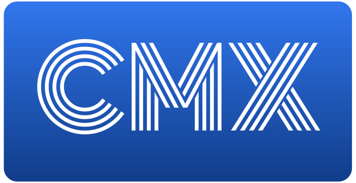

# CMX
CMX is an Open Source Solana Luanchpad Smart Contract.

# Features

- Onchain randomization
- Onchain cosigner setup for bot protection
- Supports minting for pNFT (mip1 standard), normal metaplex nfts, and more
- Supports freeze and unfreeze for post-mint

# IDL
- [IDL - cmx.json](./src/idl/cmx.json)
- [Types - cmx.ts](./src/types/cmx.ts)

Recommend to use the IDL to directly parse or CPI into the CMX onchain program with your generated SDK.

# License
Apache 2.0

# Implementation Reference
NFT-Candy-Machine v1.0.0 (Apache 2.0) https://github.com/metaplex-foundation/metaplex/blob/v1.0.0/LICENSE
